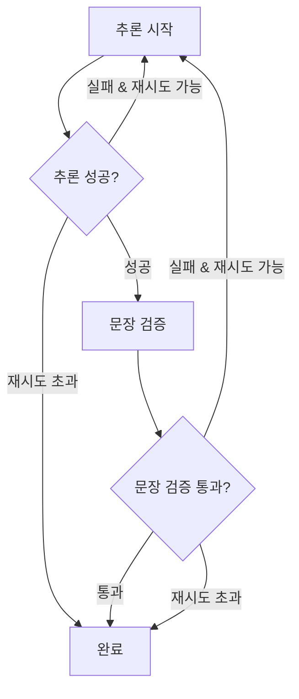

# Cohort Selection - 의료 텍스트 필터링 시스템

의료 텍스트 데이터에서 특정 조건에 맞는 환자 코호트를 선별하는 LLM 기반 필터링 시스템입니다. LangGraph의 서브그래프 패턴을 활용하여 강력한 재시도 메커니즘과 검증 로직을 구현했습니다.

## 🏗️ 아키텍처 개요

### 서브그래프 패턴 (Nested Graph Pattern)
본 시스템은 LangGraph의 서브그래프 패턴을 채택하여 다음과 같은 구조로 구성됩니다:

- **메인 그래프**: 전체 데이터 처리 파이프라인 관리
- **서브그래프**: 단일 텍스트 처리 및 검증 루프

```
메인 그래프 (FilterState)
├── 데이터 로드
├── 컨텍스트 생성  
├── 모든 텍스트 처리 ─────┐
├── 결과 마무리          │
└── 오류 처리            │
                        │
서브그래프 (SingleTextState) ←─┘
├── 추론 → 문장검증
└── 실패 시 최대 5번 재시도
```

## 🔄 워크플로우

### 메인 그래프 워크플로우
1. **데이터 로드**: 캐시에서 데이터프레임 로드 및 검증
2. **컨텍스트 생성**: 사용자 질문 기반 의료 컨텍스트 생성
3. **텍스트 처리**: 각 텍스트마다 서브그래프 호출
4. **결과 마무리**: 필터링된 데이터프레임 생성 및 저장

### 서브그래프 워크플로우 (단일 텍스트 처리)


## 📊 상태 관리

### FilterState (메인 그래프)
```python
class FilterState(TypedDict):
    # 입력 데이터
    question: str              # 사용자 질문
    data_id: str              # 데이터 ID
    task_id: str              # 작업 ID
    target_column: str        # 대상 열
    temperature: float        # LLM 온도
    
    # 처리 결과
    context: str              # 생성된 컨텍스트
    dataframe: pd.DataFrame   # 원본 데이터
    results: List[Dict]       # 처리 결과
    filtered_dataframe: pd.DataFrame  # 필터링된 데이터
    
    # 상태 관리
    status: str               # 처리 상태
    progress: float           # 진행률
    error: str                # 오류 메시지
```

### SingleTextState (서브그래프)
```python
class SingleTextState(TypedDict):
    # 입력 데이터
    text: str                 # 처리할 텍스트
    context: str              # 의료 컨텍스트
    question: str             # 사용자 질문
    
    # 처리 결과
    sentence: str             # 추출된 문장
    opinion: str              # LLM 의견
    verified_sentence: bool   # 문장 검증 결과
    
    # 루프 제어
    retry_count: int          # 현재 재시도 횟수
    max_retries: int          # 최대 재시도 횟수 (기본: 5)
    error: str                # 오류 메시지
```

## 🔧 주요 구성 요소

### 서브그래프 노드들

#### 1. `inference_single_text`
- **기능**: 단일 텍스트에 대한 LLM 추론 수행
- **입력**: 텍스트, 컨텍스트, 질문
- **출력**: 추출된 문장과 의견
- **실패 조건**: 추론 오류, 불완전한 결과

#### 2. `validate_sentence_node`
- **기능**: 추출된 문장이 원본 텍스트에서 실제 존재하는지 검증
- **검증 방법**: 문자열 포함 관계 및 유사도 검사
- **실패 조건**: 문장이 원본에 존재하지 않음


### 조건부 라우팅

#### `route_after_inference`
```python
def route_after_inference(state) -> Literal["validate_sentence", "inference", "completed"]:
    # 최대 재시도 초과 → completed
    # 추론 실패 → inference (재시도)
    # 추론 성공 → validate_sentence
```

#### `route_after_sentence_validation`
```python
def route_after_sentence_validation(state) -> Literal["inference", "completed"]:
    # 최대 재시도 초과 → completed
    # 문장 검증 성공 → completed
    # 문장 검증 실패 → inference (재시도)
```

## 🔄 재시도 메커니즘

### 재시도 조건
- **추론 실패**: LLM 오류, 불완전한 응답
- **문장 검증 실패**: 추출된 문장이 원본에 존재하지 않음

### 재시도 제한
- **최대 재시도 횟수**: 5번 (설정 가능)
- **재시도 초과 시**: 현재 상태로 처리 완료
- **각 텍스트별 독립적**: 한 텍스트의 실패가 다른 텍스트에 영향 없음

## 🚀 사용법

### 기본 사용법
```python
from graph.filter_graph import filter_runner

# 필터링 실행
filtered_df, result_id = filter_runner.run_filter(
    question="당뇨병 환자를 찾아주세요",
    data_id="patient_data_001",
    task_id="task_123",
    target_column="medical_notes",
    temperature=0.7
)
```

### 설정 옵션
```python
# config에서 설정 가능한 옵션들
{
    "llm_config": {
        "llm_type": "gpt-4",
        "temperature": 0.7
    },
    "retry_count": 5,              # 서브그래프에서 사용

}
```

## 📁 파일 구조

```
graph/
├── state.py              # 상태 클래스 정의
├── nodes.py              # 노드 함수들 및 서브그래프
├── filter_graph.py       # 메인 그래프 구성
└── agents/
    ├── prompt_generator.py    # 컨텍스트 생성
    └── llm_inference.py       # LLM 추론
```

### 주요 파일 설명

#### `state.py`
- `FilterState`: 메인 그래프 상태 정의
- `SingleTextState`: 서브그래프 상태 정의
- 초기 상태 생성 함수들

#### `nodes.py`
- 서브그래프 노드 함수들
- 조건부 라우팅 함수들
- 서브그래프 생성 및 컴파일
- 메인 그래프 노드 함수들

#### `filter_graph.py`
- 메인 그래프 구성 및 컴파일
- `FilterRunner` 클래스
- 그래프 실행 인터페이스

## 🔍 모니터링 및 디버깅

### 로깅
- 각 단계별 상세 로그 제공
- 재시도 횟수 및 실패 원인 추적
- 처리 진행률 실시간 업데이트

### 상태 추적
```python
# 작업 상태 실시간 조회
update_task_status(task_id, status, progress, message)
```

### 오류 처리
- 각 노드별 예외 처리
- 안전한 실패 처리 (graceful degradation)
- 오류 발생 시에도 부분 결과 반환

## 🎯 장점

### 1. **강력한 재시도 메커니즘**
- 각 검증 단계에서 실패 시 자동 재시도
- 최대 재시도 횟수로 무한 루프 방지

### 2. **독립적인 텍스트 처리**
- 각 텍스트별로 독립적인 서브그래프 실행
- 한 텍스트의 실패가 전체에 영향 없음

### 3. **명확한 상태 관리**
- 각 단계별 상태 명확히 구분
- 실시간 진행률 추적

### 4. **확장 가능한 구조**
- 새로운 검증 단계 쉽게 추가 가능
- 다양한 라우팅 조건 구현 가능

### 5. **디버깅 용이성**
- 상세한 로깅 및 상태 추적
- 각 단계별 결과 확인 가능

## 🔧 개발자 가이드

### 새로운 검증 단계 추가
1. `SingleTextState`에 필요한 필드 추가
2. 새 노드 함수 구현
3. 라우터 함수 수정
4. 서브그래프에 노드 및 엣지 추가

### 커스텀 라우팅 조건
```python
def custom_router(state: SingleTextState) -> Literal["next_step", "retry", "completed"]:
    # 커스텀 조건 구현
    if custom_condition(state):
        return "next_step"
    elif should_retry(state):
        return "retry"
    return "completed"
```

## 📈 성능 최적화

- **병렬 처리**: 여러 텍스트 동시 처리 가능 (향후 구현)
- **캐싱**: LLM 응답 캐싱으로 중복 호출 방지
- **배치 처리**: 유사한 텍스트 그룹별 배치 처리

## 🤝 기여 방법

1. Fork the repository
2. Create a feature branch
3. Make your changes
4. Add tests if applicable
5. Submit a pull request

## 📄 라이센스

This project is licensed under the MIT License.
